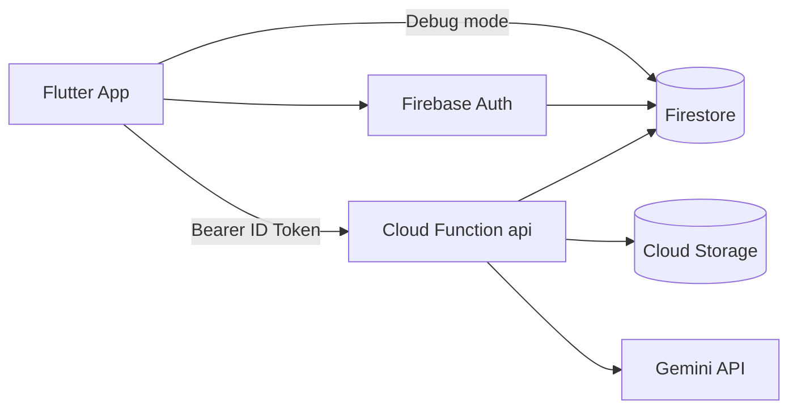

# VirtuoMate — Backend & Firebase Documentation

## Overview

Backend lives in **`virtuomate_backend_firebase/`** — Node.js Express app deployed as Firebase Cloud Function `api`.

Production URL: `https://us-central1-virtuomate.cloudfunctions.net/api`

Optional ML service: **`virtuomate_ml/`** on Google Cloud Run.

---

## Firebase Architecture



---

## Authentication Flow

1. **Email/Password:** Firebase Auth SDK on client
2. **Google Sign-In:** OAuth → Firebase credential
3. **Demo account:** `POST /auth/demo` → Firebase custom token → client `signInWithCustomToken`
4. **API calls:** `Authorization: Bearer <Firebase ID token>`
5. **Verification:** `src/middleware/auth.js` → `admin.auth().verifyIdToken()`
6. **Admin:** Custom claim `admin: true` OR email in `ADMIN_EMAILS`

**No separate JWT system** — Firebase ID tokens only.

---

## Firestore Collections

### `users/{userId}`

| Field | Type | Purpose |
|-------|------|---------|
| email | string | User email |
| displayName | string | Display name |
| phone | string | Phone |
| avatarStyle | string | Persona label |
| avatarImageUrl | string | Portrait URL |
| avatarUseTemplate | bool | Template vs photo mode |
| avatarEmotionState | string | Last emotion |
| voiceProfile | string | Encoded tone |
| voiceGender | string | male/female |
| isPremium | bool | **Server-only** |
| premiumPlan | string | Plan ID |
| videoCvCount | int | **Server-only** |
| missionProgress | int | 0–100 gamification |
| videoCvDraft | map | CV wizard state |
| preferences | map | Notifications, language, a11y |
| createdAt, updatedAt | timestamp | Audit |

### `users/{uid}/sessions/{sessionId}`

| Field | Purpose |
|-------|---------|
| type | Conversation, Interview, etc. |
| prompt | User input |
| feedback | AI coach text |
| emotion | Detected emotion |
| confidenceScore | 0–100 |
| assessment | Full score object |
| createdAt | Timestamp |

### `users/{uid}/coachChat/{messageId}`

Realtime chat messages (Flutter writes directly in Firestore mode).

### `users/{uid}/assessments/{assessmentId}`

AI assessment snapshots — **client write blocked** in rules.

### `users/{uid}/videoCvJobs/{jobId}`

Cloud FFmpeg render job status and download URLs.

---

## Cloud Storage Paths

| Path | Access |
|------|--------|
| `avatars/{userId}/*` | Public read, owner write, max 10MB |
| `video-cv/{userId}/*` | Owner read/write, max 100MB |

---

## Security Rules Strategy

**File:** `virtuomate_backend_firebase/firestore.rules`

- **Owner-only access** on user data
- **Admin read** via `request.auth.token.admin`
- **Blocked client fields:** `isPremium`, `premiumPlan`, `videoCvCount`
- **Assessments:** read owner, write false (Admin SDK only)
- **Video jobs:** create owner, update server-only

---

## API Endpoints (Complete)

| Method | Path | Auth | Description |
|--------|------|------|-------------|
| GET | `/health` | No | Stack health check |
| POST | `/auth/demo` | No | Demo custom token |
| POST | `/user/bootstrap` | Yes | Create user doc |
| GET | `/user/profile` | Yes | Read profile |
| PUT | `/user/profile` | Yes | Update profile |
| POST | `/user/export` | Yes | GDPR export |
| DELETE | `/user` | Yes | Delete account |
| POST | `/sessions` | Yes | Create session |
| GET | `/sessions` | Yes | List sessions |
| GET | `/feedback/latest` | Yes | Latest feedback |
| GET | `/analytics/user` | Yes | User analytics |
| POST | `/ai/coach` | Yes | AI coaching |
| POST | `/ai/analyze-text` | Yes | Text assessment |
| POST | `/ai/analyze-speech` | Yes | Speech assessment |
| POST | `/storage/avatar` | Yes | Upload avatar |
| POST | `/storage/avatar/vroid-from-photo` | Yes | Gemini avatar |
| POST | `/video-cv/script` | Yes | Narration script |
| POST | `/video-cv/render-job` | Yes | Start render |
| GET | `/video-cv/render-job/:id` | Yes | Job status |
| POST | `/payments/subscribe` | Yes | Premium checkout |
| POST | `/payments/webhook` | Stripe | Payment webhook |
| GET | `/admin/users` | Admin | User list |
| GET | `/admin/analytics` | Admin | Platform stats |

---

## Realtime Features

| Feature | Implementation |
|---------|----------------|
| Profile sync (API mode) | `ProfileSyncService` polls every 30s |
| Profile sync (Firestore mode) | `FirebaseAppRepository.startRealtimeSync()` snapshots |
| Coach chat | Firestore `coachChat` subcollection listeners |

---

## Environment Variables

| Variable | Purpose |
|----------|---------|
| GEMINI_API_KEY | Gemini text + image |
| GEMINI_MODEL | Default gemini-2.5-flash-lite |
| OPENAI_API_KEY | Fallback coach/image |
| AI_PROVIDER | gemini / openai / local |
| FREE_SESSION_LIMIT | Default 20 |
| ADMIN_EMAILS | Admin access |
| STRIPE_* | Payment integration |
| INTELLIGENCE_ENGINE_URL | Cloud Run ML URL |

---

## Deployment

```bash
cd virtuomate_backend_firebase
npm install
firebase deploy --only functions,firestore:rules,firestore:indexes,storage
```

Local dev: `npm start` → `http://127.0.0.1:8080`

---

## Future Improvements

- Split `app.js` into route modules
- Rate limiting per user
- Caching Gemini responses
- WebSocket for realtime coach streaming
- Firebase App Check enforcement
