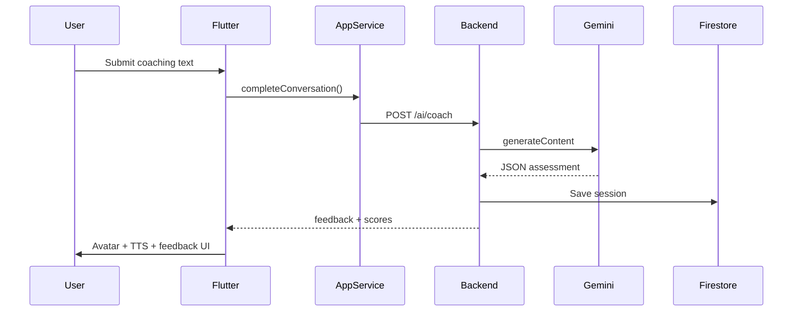

# VirtuoMate — Code Walkthrough (Start to Finish)

## 1. App Launch

```
main.dart
  WidgetsFlutterBinding.ensureInitialized()
  runApp(VirtuoMateRoot)
```

## 2. Dependency Bootstrap

```
VirtuoMateRoot._buildDeps()
  ├── USE_FIREBASE=false → InMemory everything
  ├── USE_FIREBASE=true + USE_BACKEND_API=true → ApiClient + ApiCoachEngine
  └── USE_FIREBASE=true + USE_BACKEND_API=false → Firestore direct
```

While loading: dark "Starting VirtuoMate…" screen.

## 3. Controller Creation

```
AppService(auth, repository, coachEngine, ...)
VirtuoMateController(service, initialLanguageCode from LocaleStorage)
VirtuoMateScope(notifier: controller)
VirtuoMateApp → MaterialApp routes
```

## 4. Home Gate

```
_AppHomeGate
  user != null → DashboardScreen
  user == null → WelcomeScreen
```

## 5. Login Flow

```
WelcomeScreen → "Try demo login"
  → VirtuoMateController.loginDemo()
  → AppService.signInDemo()
  → FirebaseAuthGateway → POST /auth/demo → custom token
  → bootstrapUserProfile() → POST /user/bootstrap
  → loadLocaleFromDevice()
  → DashboardScreen
```

## 6. Dashboard → Session

```
DashboardScreen → tap "Conversational Session"
  → Navigator.pushNamed(AppRoutes.session)
  → SessionScreen
```

## 7. Coaching Interaction

```
User types message → Send
  → VirtuoMateController.completeConversation(text)
  → AppService.completeConversation()
    → canRunConversation() check (premium or free limit)
    → ApiCoachEngine.generateFeedbackDetailed()
      → ApiClient.postJson('/ai/coach', { sessionType, prompt })
    → ApiAppRepository saves session
  → TtsSpeaker.speak(feedback) — coach reads aloud
  → AvatarPresence isSpeaking=true → emotion UI
  → Achievement unlock check
```

## 8. Backend AI Processing

```
POST /ai/coach (Bearer token)
  → auth.js verifyIdToken
  → coach.service.js → gemini.service.js
  → Gemini generateContent → JSON assessment
  → normalizeAssessment()
  → Response to Flutter
  → POST /sessions → Firestore users/{uid}/sessions/{id}
```

## 9. Avatar Builder Flow

```
AvatarScreen → pick photo
  → OnDeviceAvatarStylizer (local ML) OR
  → StorageService → POST /storage/avatar/vroid-from-photo (Gemini)
  → PUT /user/profile { avatarImageUrl, voiceProfile, ... }
  → ProfileAvatarThumbnail rebuilds
```

## 10. Video CV Flow

```
VideoCvWizardScreen → fill CV fields → generate script
  → POST /video-cv/script
VideoCvPreviewScreen → POST /video-cv/render-job
  → Poll GET /video-cv/render-job/:id
  → Download/share MP4
```

## 11. Settings & Logout

```
SettingsScreen → language chips → setLocale() → LocaleStorage + preferences
SettingsScreen → Logout → controller.logout() → WelcomeScreen
SettingsScreen → Delete account → DELETE /user → WelcomeScreen
```

## 12. Data Persistence Summary

| Data | Where |
|------|-------|
| Auth session | Firebase Auth (client) |
| Profile/sessions | Firestore via API or direct |
| Language pref | SharedPreferences + Firestore preferences |
| Achievements | Firestore preferences.unlockedAchievementIds |
| Avatar image | Cloud Storage URL in profile |

---

## Lifecycle Diagram


