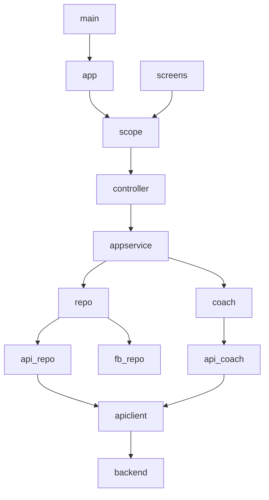

# VirtuoMate — Complete Project Structure

## Monorepo Layout

```
D:/Virtomate Project/
├── virtuomate_flutter/           # Flutter mobile app (PRIMARY)
├── virtuomate_backend_firebase/  # Node.js API on Cloud Functions
├── virtuomate_ml/                # Python ML on Cloud Run (optional)
└── virtuomate-mvp/               # Expo UI prototype (design reference)
```

---

## Flutter: `lib/` (86 files)

### Root

| File | Purpose | Key symbols | Called by |
|------|---------|-------------|-----------|
| `main.dart` | Entry point | `main()` | OS launcher |
| `firebase_options.dart` | Firebase platform config | `DefaultFirebaseOptions` | `firebase_bootstrap.dart` |

### `lib/auth/`

| File | Purpose | Key classes |
|------|---------|-------------|
| `auth_gateway.dart` | Auth abstraction + in-memory impl | `AuthGateway`, `InMemoryAuthGateway` |
| `firebase_auth_gateway.dart` | Production auth | `FirebaseAuthGateway` |
| `google_auth_helper.dart` | Google Sign-In flow | `signInWithGoogle()` |

### `lib/config/`

| File | Purpose |
|------|---------|
| `app_config.dart` | `USE_FIREBASE`, `USE_BACKEND_API`, URLs, admin emails |
| `demo_account_config.dart` | Demo email/password constants |
| `google_oauth_config.dart` | OAuth client ID defaults |

### `lib/core/`

| File | Purpose | Key types |
|------|---------|-----------|
| `models.dart` | Domain models | `UserProfile`, `SessionRecord`, `AppPreferences`, `VideoCvDraft` |
| `coaching_assessment.dart` | AI score model | `CoachingAssessment.fromJson()` |
| `avatar_emotion.dart` | 8 avatar states | `resolveAvatarEmotion()` |
| `avatar_customization.dart` | Personas, tones | `coachToneById()` |
| `achievements.dart` | Gamification | `AchievementCatalog`, unlock rules |
| `neural_connectivity.dart` | `/health` model | `NeuralConnectivityStatus` |
| `voice_profile_codec.dart` | Voice encoding | `encodeVoiceProfile()` |

### `lib/data/`

| File | Purpose | Pattern |
|------|---------|---------|
| `app_repository.dart` | Interface + InMemory | Repository |
| `firebase_app_repository.dart` | Firestore CRUD + realtime | Repository |
| `api_app_repository.dart` | REST profile/sessions | Repository |

### `lib/intelligence/`

| File | Purpose |
|------|---------|
| `coach_engine.dart` | `CoachEngine` interface, `MockCoachEngine` |
| `api_coach_engine.dart` | Live AI via `/ai/coach`, `/ai/analyze-*` |

### `lib/network/`

| File | Purpose |
|------|---------|
| `api_client.dart` | GET/POST/DELETE JSON + Bearer token |
| `api_error_message.dart` | User-friendly API errors |
| `connection_error.dart` | Network failure messages |

### `lib/services/` (15 files)

| File | Purpose |
|------|---------|
| `app_service.dart` | **Central business logic** |
| `storage_service.dart` | Avatar upload, Gemini vroid |
| `chat_service.dart` | Firestore coach chat |
| `video_cv_render_service.dart` | Cloud render jobs |
| `video_cv_export_service.dart` | Local export/share |
| `cloud_download_service.dart` | Download rendered video |
| `on_device_avatar_stylizer.dart` | ML Kit + TFLite cartoon |
| `cartoon_filter_fallback.dart` | CPU cartoon filter |
| `tts_speaker.dart` | Flutter TTS wrapper |
| `tts_voice_picker.dart` | System voice by gender |
| `neural_connectivity_service.dart` | Fetch `/health` |
| `startup_health.dart` | Bootstrap health probe |
| `profile_sync_service.dart` | Poll profile (API mode) |
| `admin_api_service.dart` | Admin REST calls |
| `locale_storage.dart` | SharedPreferences language |

### `lib/ui/` — Shell

| File | Purpose |
|------|---------|
| `app.dart` | `VirtuoMateRoot`, deps, `VirtuoMateApp`, routes |
| `virtuomate_scope.dart` | `VirtuoMateController`, `VirtuoMateScope` |
| `virtuomate_runtime.dart` | Bootstrap flags InheritedWidget |
| `virtuomate_bindings.dart` | Barrel exports |
| `app_text.dart` | i18n EN/Urdu |
| `routes.dart` | `AppRoutes` constants |

### `lib/ui/screens/` (22 files)

See FRONTEND_README.md screen table.

### `lib/ui/shared/` (14 files)

See FRONTEND_README.md components table.

### `lib/ui/mvp/`

| File | Purpose |
|------|---------|
| `mvp_shell.dart` | Gradient page scaffold |
| `mvp_widgets.dart` | VButton, VCard, VTextField, MvpTopBar |

### `lib/theme/`

| File | Purpose |
|------|---------|
| `virtuomate_mvp_theme.dart` | Colors, spacing, radii |

---

## Backend: `virtuomate_backend_firebase/`

```
virtuomate_backend_firebase/
├── index.js                 # exports.api Cloud Function
├── src/
│   ├── app.js               # ALL routes (~500+ lines)
│   ├── config.js            # env vars
│   ├── middleware/auth.js   # Firebase token verify
│   └── services/
│       ├── gemini.service.js
│       ├── coach.service.js
│       ├── assessment.service.js
│       ├── avatar_vroid.service.js
│       ├── video_cv_render.service.js
│       ├── audio_lipsync.js
│       ├── voice_tuning.js
│       ├── video_cv_layout.js
│       └── neural_connectivity.js
├── firestore.rules
├── storage.rules
└── test/assessment.local.test.js
```

---

## File Interaction Map



---

## Detailed File Template (Key Files)

### main.dart
- **Location:** `lib/main.dart`
- **Purpose:** Application entry point
- **Workflow:** Ensures Flutter binding → runs VirtuoMateRoot
- **Firebase:** None directly
- **Who uses it:** OS only

### VirtuoMateController
- **Location:** `lib/ui/virtuomate_scope.dart`
- **Purpose:** UI-facing app state and actions
- **Key methods:** `login()`, `completeConversation()`, `setLocale()`, `saveAvatarConfig()`
- **Firebase:** Via AppService → repository
- **Who uses it:** Every screen via `VirtuoMateScope.of(context)`

### AppService
- **Location:** `lib/services/app_service.dart`
- **Purpose:** Domain/business rules without Flutter imports
- **Key methods:** `completeConversation()`, `analytics()`, `bootstrapUserProfile()`
- **Who uses it:** VirtuoMateController exclusively

### ApiClient
- **Location:** `lib/network/api_client.dart`
- **Purpose:** Authenticated HTTP to Cloud Functions
- **Auth:** `Authorization: Bearer ${await user.getIdToken()}`
- **Who uses it:** ApiAppRepository, ApiCoachEngine, StorageService, etc.

---

For screen-by-screen workflow details, see **CODE_WALKTHROUGH.md** and **FRONTEND_README.md**.

For backend collections, see **DATABASE_GUIDE.md**.

For AI prompts, see **AI_GUIDE.md**.

For 100+ viva Q&A, see **VIVA_QUESTIONS_AND_ANSWERS.md**.
