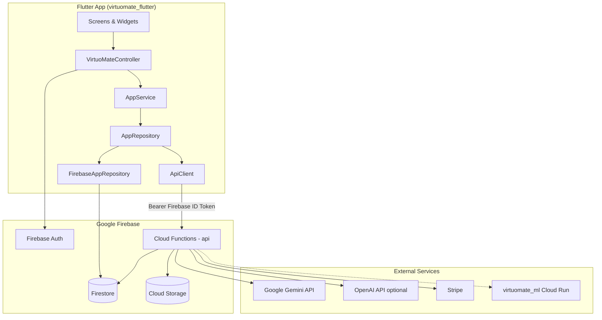

# VirtuoMate — System Architecture

## High-Level Architecture



---

## Module Breakdown

### 1. Presentation Layer (`lib/ui/`)

- **22 screens** — user-facing flows
- **Shared widgets** — avatar, neural card, forms, responsive helpers
- **MVP design system** — `MvpShell`, `VButton`, `VCard`, dark theme tokens
- **Routing** — `AppRoutes` named routes + `_AppHomeGate` for auth redirect
- **i18n** — `AppText` EN/Urdu string table

### 2. Application State (`lib/ui/virtuomate_scope.dart`)

- **`VirtuoMateController`** — ChangeNotifier facade for all UI actions
- **`VirtuoMateScope`** — InheritedNotifier for dependency injection
- Holds: user, locale, sessions, avatar config, neural status, premium flag

### 3. Domain Layer (`lib/services/app_service.dart`)

- Session completion (conversation, interview, presentation, role play)
- Auth orchestration, premium checks, achievement sync
- Analytics aggregation, mission progress
- Delegates persistence to repository, AI to coach engine

### 4. Data Layer (`lib/data/`)

| Implementation | When Used |
|----------------|-----------|
| `InMemoryAppRepository` | Offline demo, Firebase failure fallback |
| `FirebaseAppRepository` | Debug mode, direct Firestore + realtime sync |
| `ApiAppRepository` | Release mode, all writes via REST API |

### 5. Intelligence Layer (`lib/intelligence/`)

| Engine | When Used |
|--------|-----------|
| `MockCoachEngine` | No backend API — keyword-based local feedback |
| `ApiCoachEngine` | Production — calls `/ai/coach`, `/ai/analyze-*` |

### 6. Backend (`virtuomate_backend_firebase/`)

- Single Express app in `src/app.js`
- Firebase Admin SDK for Firestore/Storage/Auth
- Services: `gemini.service.js`, `coach.service.js`, `assessment.service.js`, `video_cv_render.service.js`, `avatar_vroid.service.js`

---

## Data Flow: Coaching Session

```
1. User types/speaks on SessionScreen
2. SessionScreen → VirtuoMateController.completeConversation(text)
3. AppService checks canRunConversation() (premium or free limit)
4. ApiCoachEngine.generateFeedbackDetailed() → POST /ai/coach
5. Backend auth middleware verifies Firebase token
6. coach.service.js → gemini.service.js → Gemini API
7. JSON response normalized (scores, emotion, feedback)
8. POST /sessions saves to Firestore
9. Controller notifyListeners()
10. UI updates avatar emotion, feedback screen, analytics
```

---

## Data Flow: Authentication

```
1. WelcomeScreen → login/register/Google/demo
2. FirebaseAuthGateway → Firebase Auth SDK
3. Demo: POST /auth/demo → custom token → signInWithCustomToken
4. AppService.bootstrapUserProfile() → POST /user/bootstrap
5. ApiAppRepository.hydrate() → GET /user/profile
6. VirtuoMateController.loadLocaleFromDevice()
7. _AppHomeGate shows DashboardScreen
```

---

## Data Flow: Avatar Upload

```
1. AvatarScreen picks photo
2. OnDeviceAvatarStylizer (optional) — ML Kit + TFLite cartoon (offline)
3. OR StorageService.createVroidAvatarFromPhoto() → POST /storage/avatar/vroid-from-photo
4. Backend Gemini image model generates cartoon portrait
5. Stored in Cloud Storage → URL saved to user profile
6. ProfileAvatarThumbnail + AvatarPresence display updated image
```

---

## Security Architecture

| Concern | Implementation |
|---------|----------------|
| API auth | Firebase ID token (Bearer) |
| Admin routes | Custom claim `admin: true` OR `ADMIN_EMAILS` |
| Premium tampering | Firestore rules block client writes to `isPremium` |
| Assessment integrity | `assessments` collection: client read-only |
| Video jobs | `videoCvJobs`: server-managed updates |
| API keys | Gemini/OpenAI keys server-side only, never in Flutter |

---

## Deployment Topology

| Component | Host |
|-----------|------|
| Flutter APK | Local build → sideload / Play Store |
| Cloud Functions | `us-central1-virtuomate.cloudfunctions.net/api` |
| Firestore | Firebase project `virtuomate` |
| Storage | `virtuomate.firebasestorage.app` |
| ML Engine | Google Cloud Run (optional) |

---

## Runtime Mode Matrix

| Mode | USE_FIREBASE | USE_BACKEND_API | Repository | Coach |
|------|--------------|-----------------|------------|-------|
| Offline demo | false | false | InMemory | Mock |
| Firebase debug | true | false | Firestore | Mock |
| Production | true | true | REST API | Gemini |

Release APK uses: `USE_FIREBASE=true`, `USE_BACKEND_API=true` (see `build-release-android.ps1`).
