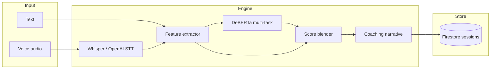

# VirtuoMate Intelligence Engine — Architecture

## 1. Mission

Build a **coaching assessment system**, not a sentiment classifier. The engine scores professional communication dimensions and produces actionable coaching output for interview, presentation, and conversation modes.

## 2. Public datasets (research summary)

| Domain | Dataset | License / access | Use in VirtuoMate |
|--------|---------|------------------|-------------------|
| Emotion (27-class) | [GoEmotions](https://github.com/google-research/google-research/tree/master/goemotions) | CC BY 4.0 | Primary emotion head; weak labels for anxiety/confidence mapping |
| Emotion (dialogue) | [MELD](https://github.com/declare-lab/MELD) | Research | Optional fine-tune for conversational tone |
| Emotion (self-report) | [ISEAR](https://www.unige.ch/cisa/research/materials-and-online-research/research-material/) | Academic | Cross-check emotion taxonomy |
| Sentiment (Twitter) | [Sentiment140](http://help.sentiment140.com/for-students.html) | Academic | Auxiliary polarity; not used as sole target |
| Personality | [MBTI Kaggle](https://www.kaggle.com/datasets/daishenghuang/mbti-type-dataset) | Kaggle ToS | Optional professionalism / style priors (derived labels only) |
| Readability | Built-in (textstat) | N/A | Clarity, professionalism proxies |
| Confidence (derived) | No gold standard at scale | — | **Pseudo-labels** from linguistics + GoEmotions mapping (see §5) |

**Confidence detection strategy:** There is no large public “interview confidence score” corpus. We train multi-task regression heads on **derived coaching scores** computed from:

- Filler rate, hedge phrases, first-person achievement markers  
- Flesch-Kincaid / sentence length / type-token ratio  
- GoEmotions → coaching emotion bucket → anxiety inverse  

This matches industry practice for communication coaches (rubric + NLP features + transformer fine-tune).

## 3. Model choice

| Stage | Model | Rationale |
|-------|--------|-----------|
| Encoder | **DeBERTa-v3-small** (`microsoft/deberta-v3-small`) | Strong NLU, smaller than base, deployable on CPU/GPU |
| Heads | 5× regression (0–100) + 1× emotion classification | Multi-task coaching metrics in one forward pass |
| Features | 24-d linguistic vector (concat to pooled embedding) | Interpretable signals; stable when data is sparse |
| Fallback | Feature-only assessor | Runs without GPU checkpoint (production bootstrap) |

**Why not BERT-only or RoBERTa-only?** DeBERTa’s disentangled attention improves fine-grained tone and hedging detection (anxiety, professionalism). RoBERTa is a supported alternate in `training/config.py`.

## 4. System architecture

## 5. Labeling strategy

1. **Emotion:** Map GoEmotions 27 labels → 8 coaching emotions (`confident`, `anxious`, `focused`, …).  
2. **Regression targets (0–100):** `prepare_coaching_labels.py` computes pseudo-scores per utterance from features + emotion.  
3. **Human-in-the-loop (future):** Export low-confidence rows for coach review; merge into `datasets/labeled/manual.jsonl`.

## 6. Training pipeline

1. `download_goemotions.py` — fetch & normalize CSV  
2. `prepare_coaching_labels.py` — feature + pseudo-label dataset  
3. `train_multitask.py` — PyTorch + HuggingFace Trainer-style loop  
4. `evaluation/metrics.py` — MAE per head, macro-F1 emotion  
5. Checkpoint → `models/checkpoints/best/`

Hyperparameters live in `ml/training/config.py` (LR 2e-5, batch 16, 3 epochs default).

## 7. Inference & MLOps

- **Service:** FastAPI (`ml/api/main.py`) — `POST /analyze-text`, `POST /analyze-speech`  
- **Deploy:** Cloud Run Docker image; Firebase Functions proxy via `INTELLIGENCE_ENGINE_URL`  
- **Node:** `assessment.service.js` + `/ai/analyze-*` + enriched `/ai/coach`  
- **Flutter:** `CoachingAssessment` on `SessionRecord`; analytics from stored scores  

## 8. Output contract

See `ml/api/schemas.py` — matches product JSON (`confidence_score`, `clarity_score`, `strengths`, `recommendations`, etc.).

## 9. Integration map

| Component | Path |
|-----------|------|
| Python ML | `virtuomate_ml/ml/` |
| REST (standalone) | `virtuomate_ml/ml/api/` |
| Firebase API | `virtuomate_backend_firebase/src/services/assessment.service.js` |
| Flutter | `lib/core/coaching_assessment.dart`, `lib/intelligence/api_coach_engine.dart` |
